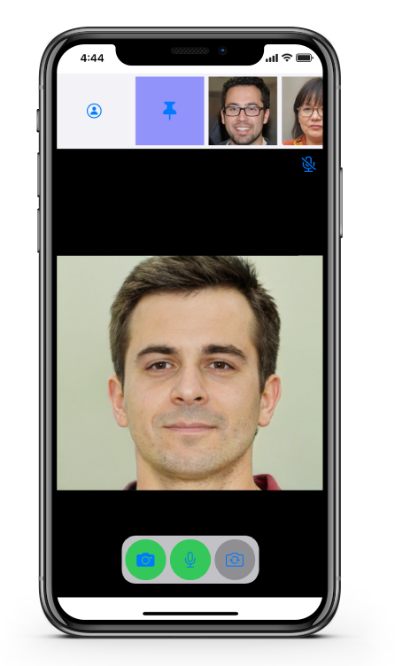

# Agora UIKit for iOS Quickstart Project

  
  
  

The source code in this repository is used in the following video Tutorial:

[Agora UIKit for iOS Video](link-coming-soon)

  

Follow the video tutorial to see how this application is built.

## Other Resources

- [iOS + macOS UIKit](https://github.com/AgoraIO-Community/iOS-UIKit)